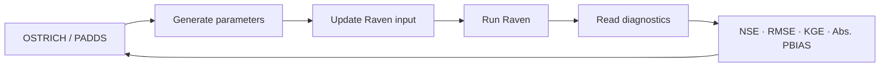

<div align="center">

# Grand River HBV Hydrologic Model

### Hydrologic Modelling and Calibration Project

[](https://raven.uwaterloo.ca/)
[](#model-configuration)
[](https://github.com/DOI-BOR/ostrich)
[](#running-the-project)

**A rainfall-runoff model of the Grand River watershed below Shand Dam, calibrated with a multi-objective PADDS workflow.**

[Overview](#model-overview) · [Files](#repository-guide) · [Run](#running-the-project) · [Calibration](#calibration-workflow) · [Results](#results-and-outputs)

</div>

---

## Project at a glance

This repository contains a complete hydrologic modelling workspace. It combines a Raven **HBV-EC** model with BasinMaker-derived watershed inputs and an **OSTRICH/PADDS** calibration workflow.

| Item | Project configuration |
|---|---|
| **Watershed** | Grand River below Shand Dam |
| **Outlet gauge** | WSC 02GA016 |
| **Hydrologic model** | Raven 4.1 |
| **Model structure** | HBV-EC |
| **Time step** | Daily |
| **Simulation start** | January 1, 2013 |
| **Simulation length** | 4,017 days |
| **Calibration tool** | OSTRICH |
| **Search algorithm** | Pareto Archived Dynamically Dimensioned Search (PADDS) |
| **Calibration length** | 200 iterations |

## Model overview

The model represents rainfall-runoff processes across the Grand River watershed using the HBV-EC structure in Raven. The workflow includes spatial watershed data, meteorological forcing, observed streamflow, parameter calibration, and generated diagnostic outputs.

### Model configuration

- Daily precipitation, temperature, and observed-flow inputs
- Snow accumulation, melt, and refreezing processes
- HBV infiltration and soil-evaporation routines
- Fast and slow reservoir representations
- Capillary rise, percolation, and baseflow processes
- Lake evaporation and watershed routing components

### Calibration objectives

Six HBV parameters are calibrated through a multi-objective PADDS search:

| Parameter | Role | Search range |
|---|---|---:|
| `par_POROSITY` | Soil storage capacity | 0.05–0.30 |
| `par_HBV_BETA` | HBV infiltration exponent | 0.50–7.00 |
| `par_FAST_BASEFLOW` | Fast-reservoir baseflow coefficient | 0.02–0.80 |
| `par_MAX_PERC` | Maximum percolation rate | 5–80 |
| `par_MELT` | Snowmelt factor | 2.00–10.00 |
| `par_SLOW_BASEFLOW` | Slow-reservoir baseflow coefficient | 0.001–0.20 |

> **Performance metrics:** NSE · RMSE · KGE · Absolute PBIAS

## Repository guide

```text
.
├── Final_model/
│   ├── BasinMaker_Data/       # DEM, elevation-band, land-cover, and soil GIS data
│   ├── Model/                 # Raven model and OSTRICH calibration workspace
│   │   ├── Model/             # Raven inputs, observations, and generated outputs
│   │   ├── GrandRiver_BM_HBV.rvp.tpl
│   │   ├── ostIn.txt
│   │   └── Ost-RAVEN.bat
│   ├── RavenInput-.../        # BasinMaker-generated Raven and GeoJSON inputs
│   ├── daily_20260713T1735.csv
│   └── Met.xlsx
├── Layout.pdf                 # Watershed and model layout
└── MY_Answer.docx             # Project report
```

<details>
<summary><strong>View key Raven files</strong></summary>

The primary Raven inputs are located in `Final_model/Model/Model/`.

| File | Purpose |
|---|---|
| `GrandRiver_BM_HBV.rvi` | Run configuration and hydrologic-process definitions |
| `GrandRiver_BM_HBV.rvh` | Watershed, subbasin, and HRU definition |
| `GrandRiver_BM_HBV.rvp` | Model parameters |
| `GrandRiver_BM_HBV.rvc` | Initial conditions |
| `GrandRiver_BM_HBV.rvt` | Forcing and observation references |
| `channel_properties.rvp` | Channel properties |
| `Lakes.rvh` | Lake and reservoir definitions |
| `data_obs/` | Meteorological and observed-flow series |
| `output/` | Simulation results and diagnostics |

</details>

## Running the project

> [!IMPORTANT]
> The supplied paths, scripts, and executables are configured for **Windows**. Only run executable files that you trust and that are compatible with your system.

### 1. Run Raven

```powershell
cd Final_model\Model\Model
.\Raven.exe GrandRiver_BM_HBV -o output\
```

### 2. Check the run

- `output/Raven_errors.txt` — warnings and errors
- `output/Diagnostics.csv` — performance metrics
- `output/Hydrographs.csv` — simulated and observed hydrographs
- `output/WatershedMassEnergyBalance.csv` — water and energy balance

## Calibration workflow

```powershell
cd Final_model\Model
.\Ostrich.exe
```



- `GrandRiver_BM_HBV.rvp.tpl` supplies parameter placeholders.
- `Ost-RAVEN.bat` launches Raven for each candidate parameter set.
- `CreateAbsPBIAS.ps1` prepares the absolute-PBIAS response.
- `ostIn.txt` controls the complete calibration workflow.

## Results and outputs

Generated outputs are retained so the completed run can be reviewed without rerunning the software.

| Output | Contents |
|---|---|
| `Diagnostics.csv` | NSE, RMSE, KGE, and percent-bias diagnostics |
| `Hydrographs.csv` | Modelled and observed discharge time series |
| `ForcingFunctions.csv` | Meteorological forcing series used by Raven |
| `ReservoirStages.csv` | Simulated reservoir-stage information |
| `WatershedStorage.csv` | Watershed storage components through time |
| `OstOutput0.txt` | OSTRICH optimization output |
| `OstNonDomSolutions0.txt` | Non-dominated parameter solutions |

## Data and reproducibility notes

- Keep all shapefile components (`.shp`, `.shx`, `.dbf`, and `.prj`) together.
- Generated outputs are versioned for transparent review of the completed model run.
- Windows binaries are included to preserve the submitted project environment.
- For new work, obtain current Raven and OSTRICH releases from their official sources.
- The included report and layout provide additional project context.

## Software references

- [Raven Hydrological Modelling Framework](https://raven.uwaterloo.ca/)
- [OSTRICH Optimization Software Toolkit](https://github.com/DOI-BOR/ostrich)

---

<div align="center">

### Author

**Akash Patel**

</div>
